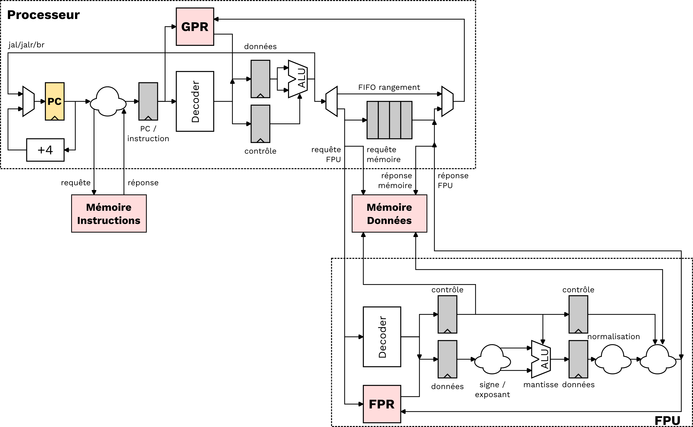
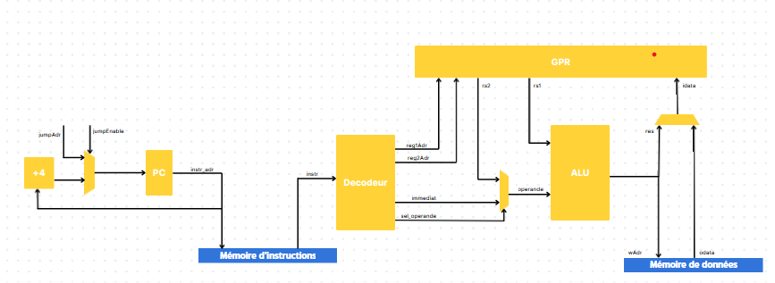

# PR214_2024: Conception d'un processeur RISC-V avec une FPU découplée



Ce répertoire sert de dépôt pour le projet de S8 [PR214](https://ccc.bordeaux-inp.fr/syllabus/index.php?annee=2023&mode=consultation&chemin=74491_76432_74444_74416_74370_74369&langue=1) de 2024 à l'ENSEIRB-MATMECA.
Le sujet est la conception d'un processeur RISC-V 32 bits et de son unité découplée pour les calculs de nombres à virgule flottante (extension F).
Les étudiants seront aidés tout le long du projet par deux encadrants.
Ce projet s'appuye sur des outils libres et ouverts, notamment sur le [langage Chisel](https://www.chisel-lang.org) pour la partie conception RTL.

## Installation du projet et des outils

Tout d'abord, ouvrez un terminal dans un environnement Linux, déplacez-vous dans le répertoire de votre choix et clonez le projet:

```
git clone git@github.com:mescoutelou/PR214_2024.git
```
*Attention, la commande ci-dessus demande d'avoir au préalable un compte Github et d'avoir configuré [une connexion SSH](https://codeur-pro.fr/acceder-en-ssh-a-vos-depots-git-distants-github/).*
Une fois le répertoire cloné, déplacez-vous à l'intérieur et ouvrez Visual Studio Code (ou un autre éditeur de texte s'il n'est pas installé):

```
cd PR214_2024
code .
```

Visualisez le script *install-local.sh*
Ce script permet d'installer localement tous les outils nécessaires pour le projet dans le répertoire *tools/*.
Dans le cas d'une machine personnel, si un des outils est déjà (ou pas) installé, (dé)commentez les lignes correspondantes puis lancez la commande:

```
source install-local.sh
```

Une fois le script exécuté, l'ensemble des outils a été téléchargé et est présent dans le projet.
Pour pouvoir les ajouter dans votre *PATH* et les utiliser directement depuis le terminal, lancez la commande suivante:

```
source setup.sh
```

Cette commande est à renouveler à chaque fois qu'un nouveau terminal est ouvert.
Dans le cas d'une machine personnel, pensez à adapter si nécessaire le chemin vers les outils installés différemment qu'avec *install-local.sh*.

## Développement et simulation

Des commandes spécifiques sont nécessaires pour compiler le Chisel, générer le Verilog et simuler une description RTL effectuée en Chisel.
Voici ci-dessous les principales d'entre elles.

Dans le fichier [src/main/scala/example/example.scala](https://github.com/mescoutelou/PR214_2024/blob/main/src/main/scala/example/example.scala), un module d'exemple **Example** est défini.
Il comporte deux entrées *i_s1* et *i_s2*, dont une paramétrable, et une sortie *o_res*.
La sortie est le résultat de l'addition des deux entrées stockées dans un registre.
A titre d'exemple, l'addition est ici effectué dans un autre module appelé **ExampleAdd**.
A la fin du fichier, un objet est créé permettant la génération SystemVerilog du module **Example** en lui passant en paramètre la valeur 4.
La commande ci-dessous permet de générer dans le répertoire *output/* la description RTL en SystemVerilog du module:

```
sbt "runMain prj.example.Example --o=output"
```

Après exécution, on retrouve dans le répertoire *output/* deux fichiers *Example.sv* et *ExampleAdd.sv*.
Chaque module Chisel voit un fichier SystemVerilog créé.

Le langage Chisel intègre aussi des commandes pour effectuer des tests.
Dans le cadre du module **Example**, le fichier de test correspondant est [src/test/scala/example/example.scala](https://github.com/mescoutelou/PR214_2024/blob/main/src/test/scala/example/example.scala).
La commande suivante permet d'exécuter tous les tests définis dans le répertoire *src/test/scala/*.

```
sbt test
```

Il est également possible d'exécuter spécifiquement le module de test **ExampleTest**:

```
sbt "testOnly prj.example.ExampleTest"
```

Après l'exécution de l'une de ces commandes, les résultats sont affichés dans le terminal.
Plus d'informations sont mises à disposition pour chacun des tests effectués dans le répertoire *test_run_dir/*.
Notamment, on retrouve dans chacun des sous-répertoires un chronogramme du test au format VCD (.vcd).
Il est possible de visualiser un chronogramme en utilisant l'outil GtkWave, en suivant le modèle de la commande suivante:

```
gtkwave Example_test_should_pass/Example.vcd
```

D'autres exemples de modules développés en Chisel sont présents (ou seront ajoutés au cours du projet) dans le répertoire [src/main/scala/example](https://github.com/mescoutelou/PR214_2024/tree/main/src/main/scala/example).
Chacun illustre des possibilités offertes par le langage.

## Organisation et planning 

Il est prévu que le projet débute le 22/01/2024 jusqu'au 07/05/2024 (durée de 15 semaines).
Ce projet est organisé en 6 grandes étapes, dont 5 seront le sujet d'une évaluation.
A la fin de chacune de ces étapes, un bilan sera effectué (brève présentation avec ou sans diapos + démo).
La note sur le travail rendu correspondra à l'avancement et aux résultats obtenus sur chacune de ces étapes.
La note finale pour le projet sera donc obtenue une fois la soutenance finale effectuée.

| Tâche                                                   | Durée (semaines) | Fin prévue | Fin réelle | Points (/20) |
| :------------------------------------------------------ | :--------------- | :--------- | :--------- | :----------- |
| Début                                                   | 0                | 22/01/2024 | 22/01/2024 | X            |
| Installation / Prise en main / Théorie                  | 3                | 12/02/2024 | XX/XX/2024 | X            |
| Première version testée de chaque composant             | 4                | 11/03/2024 | XX/XX/2024 | X            |
| Système global testé                                    | 2                | 25/03/2024 | XX/XX/2024 | X            |
| Ajout d'une instruction par composant et test           | 2                | 08/04/2024 | XX/XX/2024 | X            |
| Support de l'ensemble des instructions attendues        | 4                | 06/05/2024 | XX/XX/2024 | X            |
| Rapport                                                 | X                | 07/05/2024 | 07/05/2024 | X            |
| Soutenance                                              | X                | 07/05/2024 | 07/05/2024 | X            |

Une liste détaillées des différentes étapes du projet est disponible ci-dessous:

- [x] Début
- [ ] Installation / Prise en main / Théorie
  - [ ] Installation des outils
  - [ ] Chisel: tutoriel / livre
  - [ ] Chisel: mise en pratique (composants simples *e.g.* ALU)
  - [ ] Nombres flottants: théorie, addition en binaire, soustraction en binaire
  - [ ] RISC-V: étude de la spécification RISC-V
- [ ] Première version testée de chaque composant (instruction d'addition)
  - [ ] Echanges entre groupes pour interconnexions
  - [ ] Conception + test du premier étage
  - [ ] Conception + test du deuxième étage
  - [ ] Conception + test du troisième étage
  - [ ] Conception + test unité complète
- [ ] Système global testé
  - [ ] Création du système global
  - [ ] Connexion et adaptation des modules
  - [ ] Test des modules
  - [ ] Exécution d'instructions en langage d'assemblage RISC-V
- [ ] Ajout d'une instruction par composant et test (instruction de soustraction)
  - [ ] Modification des composants
  - [ ] Tests individuels des modules
  - [ ] Test du système complet
  - [ ] Exécution d'instructions en langage d'assemblage RISC-V
- [ ] Support de l'ensemble des instructions attendues
  - [ ] Instructions arithmétiques et logiques
  - [ ] Instructions d'accès mémoire
  - [ ] Instructions de saut
  - [ ] Instructions de branchement
  - [ ] Instructions d'échanges entiers/flottants
  - [ ] Cas particuliers
- [ ] Rapport
- [ ] Soutenance

## Règles de conception

- Utiliser des constantes avec des valeurs littérales dès que possible.
- Avant description par un langage, le fonctionnement de chaque bloc doit être descriptible sur papier.
- Une seule `Class` héritant de `Module` par fichier.
- Chaque `Class` héritant de `Module` doit être, autant que possible, clairement divisible en une partie combinatoire et des registres associés. 
- Afin de rendre le code plus clair et lisibles, les conventions de nommage suivantes doivent être respectées (aussi bien en **VHDL**/**Verilog**/**SystemVerilog**/**Chisel**):
  1. Uniquement des minuscules pour les noms de signaux et de registres.
  2. Uniquement des lettres et chiffres pour les noms de classes, le premier caractère étant une majuscule.
  3. Uniquement des majuscules pour les noms de constantes.
  4. Noms aussi courts et explicites que possible.
  5. Chaque nom de signal ou bus en entrée (`Input()`) commence par le préfixe *i_*.
  6. Chaque nom de signal ou bus en sortie (`Output()`) commence par le préfixe *o_*.
  7. Chaque nom de groupe de signaux avec des entrées ET des sorties commence par le préfixe *b_*.
  8. Chaque nom de registre (`Reg()`/`RegInit()`) commence par le préfixe *r_*.
  7. Chaque nom de signal utilisé pour l'initialisation au reset d'un registre est défini par le préfixe *init_*.
  9. Chaque nom de module (`Module()`) commence par le préfixe *m_*.
- Commenter le code de manière pertinente (une phrase explicative pour plusieurs lignes réalisant une tâche précise, ou une ligne avec une fonction particulière *etc.*).

## Documents

Les documents de base pour la bonne réalisation de ce projet sont disponibles dans le répertoire *docs/*:
- *chisel-book.pdf*: livre en version PDF (le répertoire de base est accessible [ici](https://github.com/schoeberl/chisel-book)) sur la conception en Chisel. Un certain nombre de ressources accessibles en ligne sont également listées dans l'introduction.
- *riscv-spec-1.pdf*: spécification de l'ISA RISC-V non privilégiée. Le document original est également accessible [en ligne](https://github.com/riscv/riscv-isa-manual/releases/tag/riscv-isa-release-056b6ff-2023-10-02).


## Manuel d'utilisation

Ce manuel explique l'architecture du processeur conçu et le fonctionnement de celui-ci.



### Architecture globale

L'architecture repose sur celle sur RISC-V et est constituée d'un pipeline à 3 étages (FETCH/EXEC/WB). Elle utilise une architecture de Harvard où les mémoires d'instructions et de données sont séparées.

### Composants de l'architecture

Cette section détaille le rôle et le fonctionnement de chaque composant dans son étage de pipeline.

#### Etage Fetch

Le premier étage du pipeline permet de récupérer les instructions depuis la mémoire d'instructions afin qu'elles soient décodées dans l'étage suivant. Le compteur d'adresse s'incrémente à chaque cycle d'horloge. Le comptage prend aussi en compte les sauts d'adresse. Lorsqu'un saut est appelé, le bit `jumpEnable` passe à 1 et le compteur s'incrémente en partant de cette valeur.

La mémoire délivre l'instruction correspondant à l'adresse en entrée. Elle est initialisée à partir d'un fichier texte contenant les instructions en hexadécimal. Son écriture est toujours bloquée dans le cadre de la simulation.

#### Etage Exec

L'étage Exec se compose du décodeur et de l'ALU. Le décodeur reçoit l'instruction venant de la mémoire. Tout d'abord, l'op code de l'instruction est lue pour déterminer si elle est valide. Dans le cas où une instruction invalide est détectée, le décodeur va l'ignorer et passer à la suivante (exécution d'une addition de 0 sur le registre `x0`).
Si l'instruction est valide, les paramètres tels que le numéro du registre source et la valeur immédiate sont décodés à l'aide de la documentation RISC-V.
Le décodeur gère aussi l'activation de l'écriture ou de la lecture de la mémoire données (cas d'une instruction `load` ou `store`). Il permet aussi de distinguer si les opérations arithmétiques et logiques utilisent des immédiats ou non, et de transmettre la bonne opérande à l'ALU.

L'instruction décodée passe ensuite par une ALU capable d'exécuter les opérations suivantes:
- addition
- soustraction
- OU
- ET
- OU EXCLUSIF
- décalages binaires non signé et signé

L'identification de l'opération est réalisée grâce au mot binaire `funct_sel` envoyé par le décodeur.


#### Etage WriteBack

Le dernier étage du pipeline est constitué de la mémoire de données et de la file de registre.

La file de registre (GPR) est consituée de 32 registres de 32 bits. Elle possède deux ports de lecture et un port d'écriture. Les requêtes de lecture des registres sont transmises par le décodeur qui fournit les numéros correspondants. Les données lues sont envoyées dans l'ALU.
L'écriture de la file doit être activée par le décodeur pour fonctionner. La donnée à écrire peut provenir soit de l'ALU dans le cas où une opération arithmétique est exécutée, soit de la mémoire de données si c'est une instruction `load`.

Les modules de mémoires (instructions et données) sont générés par la structure `SyncReadMem` fournie par Chisel. Elles ont été paramétrées pour contenir 1024 cases mémoire de 32 bits.

La mémoire de données contient celles stockées par le programme lors de son exécution. Le jeu d'instruction RISC-V lui permet de charger ses données dans le GPR avec la commande `load` et de les stocker dans le GPR avec la commande `store`. L'adresse mémoire doit être calculée par l'ALU et est égale à la somme d'une donnée de registre et d'un immédiat.

### Mécanismes implantés

Le pipeline est amené à créer des dépendances de données. Pour éviter cela, un pipeline peut être mis en place

### Simulation du processeur

La simulation du processeur permet d'exécuter des programmes et de visualiser les données stockées dans les différentes mémoires en plus des signaux internes grâce à gtkwave.

Un fichier *doc_memoire* contient deux fichiers texte *d_mem.txt* et *i_mem.txt* correspondant respectivement à la mémoire de données et d'instruction. Il est possible d'initialiser ces deux mémoires en écrivant les données sous forme hexadécimale et en séparant chaque donnée par un retour à la ligne.

Pour observer les données, le module de test `top_fetch_exec_mem_test` doit être compilé et va générer le fichier *.vcd* contenant les chronogrammes. Ce testbench ne permet que de générer des périodes d'horloge étant donné que le processeur gère les autres signaux internes de manière autonome. Le nombre de cycles simulés peut être modifié à la ligne 15 du fichier.